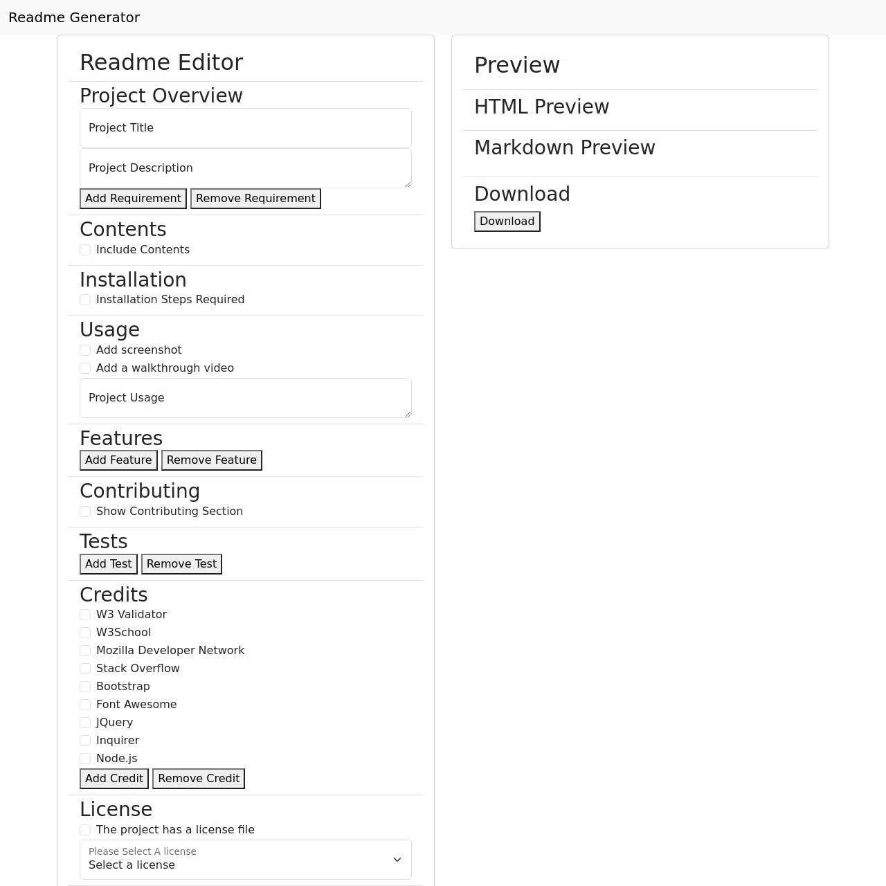

# Bootcamp Challenge 11 - Readme Generator

## Description

This project was created using node.js with the fs and inquirer modules to make a command-line tool that generates a professional readme.

I also added a webpage using the same custom module to make a different method of creating the readme.

The project had the following requirements:

- A command line interface that accepts user input.

- The project creates a professional readme with the following sections: Project title, Description, Table of Contents, Installation, Usage, License, Contributing, Tests, Questions.

- When a user enters the project title, it's displayed as the title of the README.

- When a user enters a description, installation instructions, usage information, contribution guidelines, and test instructions, this information is added to the sections of the README entitled Description, Installation, Usage, Contributing, and Tests.

- When a user chooses a license for their application from a list of options, a badge for that license is added near the top of the README and a notice is added to the section of the README entitled License that explains which license the application is covered under.

- When a user enters their GitHub username, it's added to the section of the README entitled Questions, with a link to their GitHub profile.

- When a user enters their email address, it's added to the section of the README entitled Questions, with instructions on how to reach them with additional questions.

- When a user clicks on the links in the Table of Contents, they are taken to the corresponding section of the README.

## Table of Contents

- [Description](#description)

- [Table of Contents](#table-of-contents)

- [Installation](#installation)

- [Usage](#usage)

- [Features](#features)

- [Contributing](#contributing)

- [Credits](#credits)

- [License](#license)

- [Questions](#questions)

## Installation

For node.js, install node.js as per the instructions on its webpage. This can be found in the credits section. Once it is installed, run "npm install" on the root of the project folder in a terminal window. Once this is complete run "node index.js".

For the web-based option, just go to the [website](https://bowseruk.github.io/readme-generator-nodejs/).

## Usage

A screenshot of the project can be seen below:

A walkthrough video of the project can be seen at [this link](https://youtu.be/CzYmF4DcMDI)

To use the node.js module, go to the root folder and run "node index.js". Answer the prompts as you want the answers to appear on the readme file. After answering all the questions the readme will be generated in the output folder as readme.md.

To use the browser, go to the [website](https://bowseruk.github.io/readme-generator-nodejs/) and fill in the fields. Once the preview looks good, press the download button.

## Features

This project has the following features:

- Node.js command line interface

- Web-based interface

- Modules

## Contributing

Feel free to raise an issue or message me. Please raise an issue before a pull request, and tag the pull request with the issue it relates to.

## Tests

There are currently no tests for this project.

## Credits

The following resources were important for this project.

- [Readme Generator](https://github.com/bowseruk/readme-generator-nodejs) for generating the readme.

- This site was based on a project by edX Boot Camps LLC.

- The changes were checked with [W3C Validator](https://validator.w3.org/).

- [W3School](https://www.w3schools.com/) was used as a reference for elements to use and good practice.

- [MDN](https://developer.mozilla.org/en-US/) is a very comprehensive and useful resource.

- [Stack Overflow](https://stackoverflow.com/) always seems to have the answer to a problem that occurs.

- [Bootstrap](https://getbootstrap.com/) was used in this project using the documentation on their website.

- [JQuery](https://jquery.com/) documentation was referred to throughout the project.

- The [Inquirer](https://www.npmjs.com/package/inquirer) package was used with node.js, following the documentation.

- [Node.js](https://nodejs.org/) was used in the project, following documentation from their site.

## License

This project is licensed under the [MIT](https://opensource.org/licenses/MIT) license.

This full license used by the project is in the LICENSE file of the repo.

## Questions

Please contact me with any questions by:

- Github Discussion: Add a discussion to this repo.

- My Github Username is [BowserUK](https://github.com/bowseruk): Feel free to find more contact details or browse my other Repos.